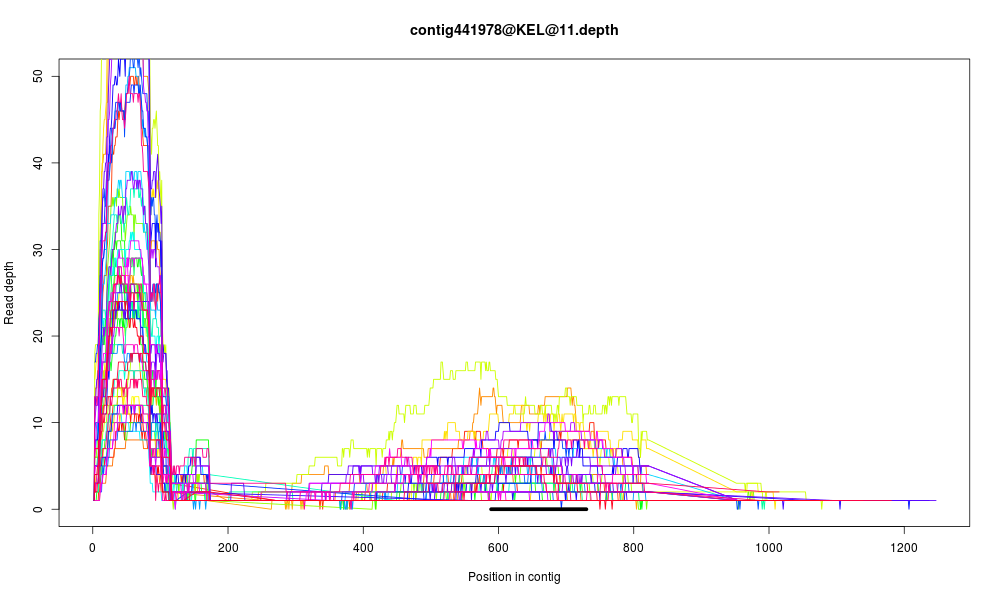

*Summary:*
========
This repository holds the code used to analyze data from an exon capture experiment.

The general strategy is as follows:

  1. Quality control data (remove reads not passing CASAVA filter, remove adapter contamination, window-trim for sequence quality, merge overlapping reads)
  2. Combine data for all of the libraries for a single species into a single set of fastq files
  3. Perform targeted assemblies of our exon data using the [ARC assembly pipeline from iBest](http://ibest.github.io/ARC/)
  4. Map reads from individual libraries back to the assemblies made with ARC to assess how different laboratory conditions affected capture efficiency
  
The pipeline is run from a driver script called `runAnalyses.pl`. You must provide it with a configuration file as follows: `perl runAnalyses.pl -c configurationFile.txt`. The configuration file contains information regarding the names of the sample libraries and where they are located. Its form should be as follows (it includes one header row and should contain no whitespace):

```
AdapterFolder=./adapters
ReadsFolder=./concatenatedReads
QCoutputFolder=./qc
ARCworkingFolder=/home/evan/ramdisk
threads=30
targets=targets.fasta
cycles=6
timeout=180

Sample=SampleID1   
Sample=SampleID2
Sample=SampleID3
...
Sample=SampleIDlast

```
  
  
*Initial housekeeping:*
=====================

The manderCap repository should be in the same directory as the directories containing the read data (in this case those directories are called Project_Shaffer and Undetermined_indices). We'll call this top-level directory that contains the manderCap repo and the Project_Shaffer and Undetermined_indeces folders "topDirectory" from here on out.


Move all the reads from their Sample folders into a single directory:

`cd topDirectory`

`mkdir allReads`

`mv Project_Shaffer/Sample_0*/*.fastq.gz allReads/`

We don't need the empty sample folders, Sample Sheets, or Basecall_Stats. We also won't use the reads that weren't demultiplexed. So nuke those:

`rm -r Project_Shaffer`

`rm -r Undetermined_indices`

Now we want to make a single R1 and single R2 file for each sample. We'll put those into a new directory:

`mkdir concatenatedReads`

`cd allReads`

`bash ../manderCap/concatenateSampleReads.sh > ../logs/concatenateSampleReads.log 2>&1`

We also want the read files to be unzipped:

`cd ../concatenatedReads; gunzip *.gz > ../logs/gunzipSampleReads.log 2>&1`


Finally, we want to produce the sample-specific adapter FASTAs that we'll use to trim adapter contamination:

`cd topDirectory`

`mkdir adapters`

`perl manderCap/generate_adapter_fastas.pl --in manderCap/HSEM020_adaptersKey.txt --out adapters --adapters itru > logs/generate_adapter_fastas.log 2>&1`


Run the QC and assemblies:
-------------------------
The following command runs all the read QC and ARC assemblies (see that script for details):

`perl manderCap/runAnalyses.pl -c manderCap/manderCap.config > logs/runAnalyses.stdout 2>logs/runAnalyses.stderr`


Assembly preparation:
---------------------
After ARC has run, we'll process the ARC assembled contigs to arrive at our final
reference that we'll use to map all of our individual libraries to. We first want
to designate a single assembled contig that is representative of each target. To do
this, we'll find the Reciprocal Best Blast Hits (RBBHs) for each target. This is
performed by manderCap/findRBBHs.pl. Briefly, it blasts the contigs in the assembly
against the sequences in the target fasta file. Then it blasts the targets in the
fasta file against the assembly. Then it goes through these blast reports and finds
all instances where the targets had at least one hit to the assembly. For all of the
best hits, it checks to make sure that that target was also found as the best hit
when we blasted the assembly against the targets (hence the reciprocal part).


`cd ARC/finished_allCTS/`

`cp contigs.fasta contigs.CTSonly6iter.fasta`

`../../manderCap/findRBBHs.pl --assembly contigs.CTSonly6iter.fasta --targets ../../targets.fasta --out RBBHs.CTSonly6iter.fasta`


That process finds a total of 8386 reciprocal best blast hits (over 96%). If we were
to map reads to this assembly and visualize coverage, we'd see a fair amount of targets
that have spikes in read coverage at the ends of the targets. This can be the result
of several things. It's possible that these are true repetitive regions that exist
at the edges of our target (at the periphery of the exons, for instance). They may
also be due to chimerism in our assemblies, whereby repetitive, non-contiguous genomic
regions are grafted onto the edges targets due to challenges in <em>de novo</em> assembly.
Here is one example of what what I'm talking about (the black bar represents the portion
of the target that blasted to that assembled contig):




Individual read mapping:
------------------------


